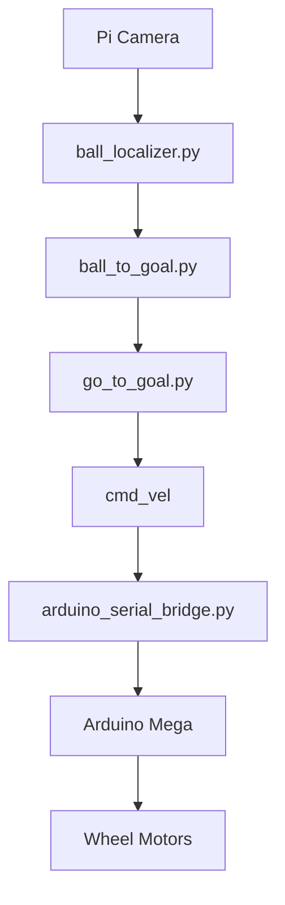
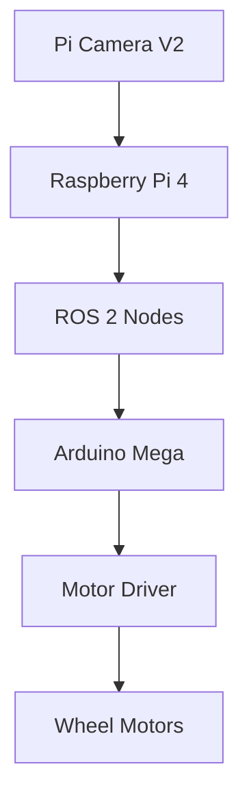

  

### ROS 2 Autonomous Mobile Robot Platform

 

  
  
  
  
  
  
  
  

  
  
  

---

## 📖 Project Overview

**Pavlov Mini Wheel** is an open-source autonomous mobile robot developed as a complete robotics platform that bridges simulation and real-world deployment through a modular ROS 2 architecture.

The project combines **computer vision**, **robot control**, **embedded systems**, and **simulation** into a unified robotics pipeline. A Raspberry Pi Camera continuously observes the environment, detects a target object using OpenCV, estimates its position, generates a navigation goal, and autonomously drives the robot toward the target. Motion commands are transmitted to an Arduino Mega through a serial communication bridge, enabling reliable interaction between high-level ROS 2 software and low-level motor control.

Unlike monolithic robotics applications, Pavlov Mini Wheel is designed around independent ROS 2 nodes. Each subsystem is responsible for a single task—perception, localization, navigation, or hardware communication—making the project easier to understand, maintain, and extend.

The same software architecture can be expanded with additional sensors, localization systems, path planning algorithms, or autonomous behaviors without requiring significant modifications to the existing codebase.

---

# 🚀 System Highlights

| Feature | Description |
|----------|-------------|
| Framework | ROS 2 Humble |
| Programming Languages | Python, C++ |
| Simulation | Gazebo |
| Visualization | RViz |
| Computer Vision | OpenCV |
| Robot Type | Differential Drive Mobile Robot |
| Camera | Raspberry Pi Camera V2 |
| Embedded Controller | Arduino Mega |
| Communication | USB Serial |
| Robot Model | Custom URDF |
| Platform | Ubuntu 22.04 |

---

# 🏛️ Software Architecture

Pavlov Mini Wheel follows a layered robotics architecture where every software component has a dedicated responsibility.

Instead of processing perception, navigation, and hardware communication inside a single executable, the system separates each responsibility into individual ROS 2 nodes.

This modular approach offers several advantages:

- easier debugging
- independent module development
- reusable software components
- better scalability
- simplified testing
- cleaner software architecture

The complete software pipeline is illustrated below.

---

## 🔄 Autonomous Pipeline

| Step | Description |
|------|-------------|
| 📷 **Image Acquisition** | Capture frames from Raspberry Pi Camera |
| 🎯 **Object Detection** | Detect the red ball using OpenCV |
| 📍 **Localization** | Estimate the target position |
| 🧠 **Goal Generation** | Compute a navigation goal |
| 🚗 **Motion Control** | Generate velocity commands |
| 🔌 **Embedded Interface** | Send commands to Arduino Mega |
| 🛞 **Robot Motion** | Drive the differential robot |

The robot continuously processes visual information, estimates the target position, generates a navigation goal, computes motion commands, and controls the wheel motors through an Arduino-based embedded controller.

---

# 🔌 Hardware Architecture

The robot consists of two primary computing layers.

The Raspberry Pi executes all high-level robotics software including perception, localization, navigation, and ROS 2 communication.

The Arduino Mega receives velocity commands over a serial interface and directly controls the wheel motors.

---

# 🧠 Core Robotics Pipeline

The project is organized around four primary software components.

## ① Ball Detection

The camera continuously captures images from the environment.

OpenCV is used to detect the red target object through HSV color segmentation and contour analysis.

Once detected, the target position is estimated relative to the robot.

---

## ② Goal Generation

The detected target position is transformed into a navigation goal.

Instead of driving directly toward image pixels, the robot computes a goal position that can be safely followed by the navigation controller.

---

## ③ Motion Control

The navigation controller computes the required linear and angular velocities necessary to reach the generated goal.

Velocity commands are continuously updated as the target moves.

---

## ④ Embedded Control

The computed velocity commands are transmitted through a serial interface to an Arduino Mega.

The Arduino converts these commands into motor signals that drive the differential mobile robot.

---

# 🎯 Design Goals

Pavlov Mini Wheel was developed with the following engineering objectives:

- Build a modular ROS 2 software architecture.
- Bridge simulation and physical hardware.
- Separate perception, planning, and control into reusable nodes.
- Simplify future integration of additional sensors.
- Provide a practical robotics platform for experimentation and education.
- Demonstrate a complete autonomous robotics pipeline from perception to motion.

---

> **Pavlov Mini Wheel is not only a simulation project—it is a modular robotics platform designed to demonstrate how modern ROS 2 systems integrate computer vision, autonomous navigation, and embedded hardware into a complete autonomous mobile robot.**
